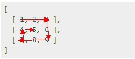

# 第四十章、螺旋矩阵

Given a matrix of m x n elements (m rows, n columns), return all elements of the matrix in spiral order。一句话，即为螺旋矩阵问题。

举个例子，给定如下的一个矩阵:


你应该返回：[1,2,3,6,9,8,7,4,5]。如下图所示，遍历顺序为螺旋状：



以下是一份参考代码：

```cpp
//代码来源:http://discuss.leetcode.com/questions/29/spiral-matrix 
class Solution {      
public:      
    vector<int> spiralOrder(vector<vector<int> >& matrix) {      
        vector<int> result;      
        if (matrix.empty()) return result;      
        ssize_t beginX = 0, endX = matrix[0].size() - 1;      
        ssize_t beginY = 0, endY = matrix.size() - 1;      
  
        while (true) {      
            // From left to right      
            for (ssize_t i = beginX; i <= endX; ++i)      
                result.push_back(matrix[beginY][i]);      
            if (++beginY > endY) break;      
  
            // From top down      
            for (ssize_t i = beginY; i <= endY; ++i)      
                result.push_back(matrix[i][endX]);      
            if (beginX > --endX) break;      
  
            // From right to left      
            for (ssize_t i = endX; i >= beginX; --i)      
                result.push_back(matrix[endY][i]);      
            if (beginY > --endY) break;      
  
            // From bottom up      
            for (ssize_t i = endY; i >= beginY; --i)      
                result.push_back(matrix[i][beginX]);      
            if (++beginX > endX) break;      
        }      
        return result;      
    }      
};      
```
