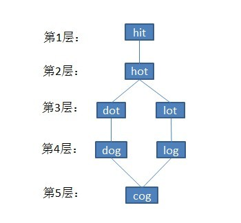

##第三十二章、最小操作数

### 题目描述

给定一个单词集合Dict，其中每个单词的长度都相同。现从此单词集合Dict中抽取两个单词A、B，我们希望通过若干次操作把单词A变成单词B，每次操作可以改变单词的一个字母，同时，新产生的单词必须是在给定的单词集合Dict中。求所有行得通步数最少的修改方法。

举个例子如下：

  Given:
     A = "hit"
     B = "cog"
     Dict = ["hot","dot","dog","lot","log"]
  Return
   [
     ["hit","hot","dot","dog","cog"],
     ["hit","hot","lot","log","cog"]
   ]

即把字符串A = "hit"转变成字符串B = "cog"，有以下两种可能：

"hit" -> "hot" ->  "dot" ->  "dog" -> "cog"；

"hit" ->  "hot" ->  "lot" ->  "log"  ->"cog"。

## 分析与解法

本题是一个典型的图搜索算法问题。此题看似跟本系列的第29章的字符串编辑距离相似，但其实区别特别大，原因是最短编辑距离是让某个单词增加一个字符或减少一个字符或修改一个字符达到目标单词，来求变换的最少次数，但此最小操作数问题就只是改变一个字符。 

通过[此文](http://blog.csdn.net/v_JULY_v/article/details/6111353)，我们知道，在图搜索算法中，有深度优先遍历DFS和广度优先遍历BFS，而题目中并没有给定图，所以需要我们自己建立图。



涉及到图就有这么几个问题要思考，节点是什么？边如何建立？图是有方向的还是无方向的？包括建好图之后，如何记录单词序列等等都是我们要考虑的问题。

### 解法一、单向BFS法

__1__、建图

对于本题，我们的图的节点就是字典里的单词，两个节点有连边，对应着我们可以把一个单词按照规则变为另外一个单词。比如我们有单词hat，它应该与单词cat有一条连边，因为我们可以把h变为c，反过来我们也可以把c变为h，所以我们建立的连边应该是无向的。

如何建图？有两种办法，

* 第一种方法是：我们可以把字典里的任意两个单词，通过循环判断一下这两个单词是否只有一个位置上的字母不同。即假设字典里有n个单词，我们遍历任意两个单词的复杂度是O(n2)，如果每个单词长度为length，我们判断两个单词是否连边的复杂度是O(length)，所以这个建图的总复杂度是O(n2*length)。但当n比较大时，这个复杂度非常高，有没有更好的方法呢？

* 第二种方法是：我们把字典里地每个单词的每个位置的字母修改一下，从字典里查找一下（若用基于red-black tree的map查找，其查找复杂度为O(logn)，若用基于hashmap的unordered_map，则查找复杂度为O(1)），修改后的单词是否在字典里出现过。即我们需要遍历字典里地每一个单词O(n)，尝试修改每个位置的每个字母，对每个位置我们需要尝试26个字母（其实是25个，因为要改得和原来不同），因此这部分复杂度是O(26*length)，总复杂度是O(26 * n * length)  （第二种方法优化版：这第二种方法能否更优？在第二种方法中，我们对每个单词每个位置尝试了26次修改，事实上我们可以利用图是无向的这一特点，我们对每个位置试图把该位置的字母变到字典序更大的字母。例如，我们只考虑cat变成hat，而不考虑hat变成cat，因为再之前已经把无向边建立了。这样，只进行一半的修改次数，从而减少程序的运行时间。当然这个优化从复杂度上来讲是常数的，因此称为常数优化，此虽算是一种改进，但不足以成为第三种方法，原因是我们经常忽略O背后隐藏的常数）。

OK，上面两种方法孰优孰劣呢？直接比较n2*length 与 26 * n * length的大小。很明显，通常情况下，字典里的单词个数非常多，也就是n比较大，因此第二种方法效果会好一些，稍后的参考代码也会选择上述第二种方法的优化。

__2__、记录单词序列

对于最简单的bfs，我们是如何记录路径的？如果只需要记录一条最短路径的话，我们可以对每个走到的位置，记录走到它的前一个位置。这样到终点后，我们可以不断找到它的前一个位置。我们利用了最短路径的一个特点：即第二次经过一个节点的时候，路径长度不比第一次经过它时短。因此这样的路径是没有圈的。

但是本题需要记录全部的路径，我们第二次经过一个节点时，路径长度可能会和第一次经过一个节点时路径长度一样。这是因为，我们可能在第i层中有多个节点可以到达第(i + 1)层的同一个位置，这样那个位置有多条路径都是最短路径。

如何解决呢？——我们记录经过这个位置的前面所有位置的集合。这样一个节点的前驱不是一个节点，而是一个节点的集合。如此，当我们第二次经过一个第(i+ 1)层的位置时，我们便保留前面那第i层位置的集合作为前驱。

__3__、遍历

解决了以上两个问题，我们最终得到的是什么？如果有解的话，我们最终得到的是从终点开始的前一个可能单词的集合，对每个单词，我们都有能得到它的上一个单词的集合，直到起点。这就是bfs分层之后的图，我们从终点开始遍历这个图的到起点的所有路径，就得到了所有的解，这个遍历我们可以采用之前介绍的dfs方法（路径的数目可能非常多）。

其实，为了简单起见，我们可以从终点开始bfs，因为记录路径记录的是之前的节点，也就是反向的。这样最终可以按顺序从起点遍历到终点的所有路径。

参考代码如下：

```cpp
//copyright@caopengcs     
//updated@July 08/12/2013    
class Solution    
{    
public:    
    // help 函数负责找到所有的路径    
    void help(intx,vector<int> &d, vector<string> &word,vector<vector<int> > &next,vector<string> &path,vector<vector<string> > &answer)
    {
        path.push_back(word[x]);    
        if (d[x] == 0)
        {   //已经达到终点了
            answer.push_back(path);    
        }    
        else
        {
            int i;    
            for (i = 0; i <next[x].size(); ++i)
            {
                help(next[x][i],d, word, next,path,answer);    
            }    
        }    
        path.pop_back();   //回溯    
    }    
  
    vector<vector<string>> findLadders(string start, string end, set<string>& dict)    
    {    
        vector<vector<string> > answer;    
        if (start == end)
        {   //起点终点恰好相等
            return answer;    
        }    
        //把起点终点加入字典的map    
        dict.insert(start);    
        dict.insert(end);    
        set<string>::iterator dt;    
        vector<string> word;    
        map<string,int>allword;    
        //把set转换为map，这样每个单词都有编号了。    
        for (dt = dict.begin(); dt!= dict.end(); ++dt)
        {
            word.push_back(*dt);    
            allword.insert(make_pair(*dt, allword.size()));    
        }    
  
        //建立连边 邻接表    
        vector<vector<int> > con;    
        int i,j,n =word.size(),temp,len = word[0].length();    
        con.resize(n);    
        for (i = 0; i < n; ++i)
        {
            for (j = 0; j <len; ++j)
            {
                char c;    
                for (c =word[i][j] + 1; c <= 'z'; ++c)
                {  //根据上面第二种方法的优化版的思路，让每个单词每个位置变更大
                    char last =word[i][j];    
                    word[i][j] =c;    
                    map<string,int>::iterator t = allword.find(word[i]);    
                    if (t !=allword.end())
                    {
                        con[i].push_back(t->second);    
                        con[t->second].push_back(i);    
                    }    
                    word[i][j] =last;    
                }    
            }    
        }    
  
        //以下是标准bfs过程    
        queue<int> q;    
        vector<int> d;    
        d.resize(n, -1);    
        int from = allword[start],to = allword[end];    
        d[to] = 0;  //d记录的是路径长度，-1表示没经过    
        q.push(to);    
        vector<vector<int> > next;    
        next.resize(n);    
        while (!q.empty())
        {
            int x = q.front(), now= d[x] + 1;    
            //now相当于路径长度  
            //当now > d[from]时，则表示所有解都找到了  
            if ((d[from] >= 0)&& (now > d[from]))
            {
                break;    
            }    
            q.pop();    
            for (i = 0; i <con[x].size(); ++i)
            {
                int y = con[x][i];    
                //第一次经过y  
                if (d[y] < 0)
                {
                    d[y] = now;    
                    q.push(y);    
                    next[y].push_back(x);    
                }    
                //非第一次经过y  
                else if (d[y] ==now)
                {  //是从上一层经过的，所以要保存
                    next[y].push_back(x);    
                }    
            }    
        }    
        if (d[from] >= 0)
        {  //有解
            vector<string>path;    
            help(from, d,word,next, path,answer);    
        }    
        return answer;    
    }    
};
```

### 解法二、双向BFS法

BFS需要把每一步搜到的节点都存下来，很有可能每一步的搜到的节点个数越来越多，但最后的目的节点却只有一个。后半段的很多搜索都是白耗时间了。

上面给出了单向BFS的解法，但看过此前blog中的这篇文章[“A*、Dijkstra、BFS算法性能比较演示”](http://blog.csdn.net/v_JULY_v/article/details/6238029)可知：双向BFS性能优于单向BFS。

举个例子如下，第1步，是起点，1个节点，第2步，搜到2个节点，第3步，搜到4个节点，第4步搜到8个节点，第5步搜到16个节点，并且有一个是终点。那这里共出现了31个节点。从起点开始广搜的同时也从终点开始广搜，就有可能在两头各第3步，就相遇了，出现的节点数不超过(1+2+4)*2=14个，如此就节省了一半以上的搜索时间。

下面给出双向BFS的解法，参考代码如下：

```cpp
//copyright@fuwutu 6/26/2013  
class Solution  
{  
public:  
    vector<vector<string>> findLadders(string start, string end, set<string>& dict)  
    {  
        vector<vector<string>> result;  
        if (dict.erase(start) == 1 && dict.erase(end) == 1)   
        {  
            map<string, vector<string>> kids_from_start;  
            map<string, vector<string>> kids_from_end;  
  
            set<string> reach_start;  
            reach_start.insert(start);  
            set<string> reach_end;  
            reach_end.insert(end);  
  
            set<string> meet;  
            while (meet.empty() && !reach_start.empty() && !reach_end.empty())  
            {  
                if (reach_start.size() < reach_end.size())  
                {  
                    search_next_reach(reach_start, reach_end, meet, kids_from_start, dict);  
                }  
                else  
                {  
                    search_next_reach(reach_end, reach_start, meet, kids_from_end, dict);  
                }  
            }  
  
            if (!meet.empty())  
            {  
                for (set<string>::iterator it = meet.begin(); it != meet.end(); ++it)  
                {  
                    vector<string> words(1, *it);  
                    result.push_back(words);  
                }  
  
                walk(result, kids_from_start);  
                for (size_t i = 0; i < result.size(); ++i)  
                {  
                    reverse(result[i].begin(), result[i].end());  
                }  
                walk(result, kids_from_end);  
            }  
        }  
  
        return result;  
    }  
  
private:  
    void search_next_reach(set<string>& reach, const set<string>& other_reach, set<string>& meet, map<string, vector<string>>& path, set<string>& dict)  
    {  
        set<string> temp;  
        reach.swap(temp);  
  
        for (set<string>::iterator it = temp.begin(); it != temp.end(); ++it)  
        {  
            string s = *it;  
            for (size_t i = 0; i < s.length(); ++i)  
            {  
                char back = s[i];  
                for (s[i] = 'a'; s[i] <= 'z'; ++s[i])  
                {  
                    if (s[i] != back)  
                    {  
                        if (reach.count(s) == 1)  
                        {  
                            path[s].push_back(*it);  
                        }  
                        else if (dict.erase(s) == 1)  
                        {  
                            path[s].push_back(*it);  
                            reach.insert(s);  
                        }  
                        else if (other_reach.count(s) == 1)  
                        {  
                            path[s].push_back(*it);  
                            reach.insert(s);  
                            meet.insert(s);  
                        }  
                    }  
                }  
                s[i] = back;  
            }  
        }  
    }  
  
    void walk(vector<vector<string>>& all_path, map<string, vector<string>> kids)  
    {  
        vector<vector<string>> temp;  
        while (!kids[all_path.back().back()].empty())  
        {  
            all_path.swap(temp);  
            all_path.clear();  
            for (vector<vector<string>>::iterator it = temp.begin(); it != temp.end(); ++it)  
            {  
                vector<string>& one_path = *it;  
                vector<string>& p = kids[one_path.back()];  
                for (size_t i = 0; i < p.size(); ++i)  
                {  
                    all_path.push_back(one_path);  
                    all_path.back().push_back(p[i]);  
                }  
            }  
        }  
    }  
};  
```

##参考链接及推荐阅读
1. caopengcs，[最小操作数](http://blog.csdn.net/caopengcs/article/details/9919341)；
2. [编程艺术第29章字符串编辑距离](http://blog.csdn.net/v_july_v/article/details/8701148#t4)
3. matrix67，[十个利用矩阵乘法解决的经典题目：](http://www.matrix67.com/blog/archives/276)
4. leetcode上[最小操作数一题](http://leetcode.com/onlinejudge#question_126)
5. [超然烟火](http://blog.csdn.net/sunnianzhong/article/details/9326289)
