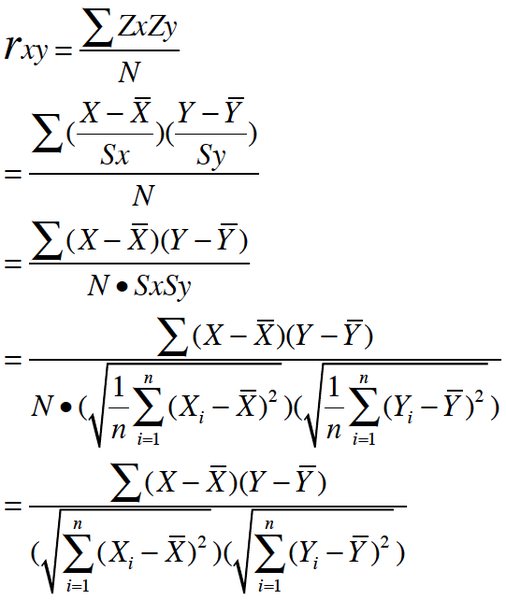

# K近邻算法与距离度量表示法


## 第一部分、K近邻算法

### 1.1、什么是K近邻算法

何谓K近邻算法，即K-Nearest Neighbor algorithm，简称KNN算法，单从名字来猜想，可以简单粗暴的认为是：K个最近的邻居，当K=1时，算法便成了最近邻算法，即寻找最近的那个邻居。为何要找邻居？打个比方来说，假设你来到一个陌生的村庄，现在你要找到与你有着相似特征的人群融入他们，所谓入伙。

用官方的话来说，所谓K近邻算法，即是给定一个训练数据集，对新的输入实例，在训练数据集中找到与该实例最邻近的K个实例（也就是上面所说的K个邻居），这K个实例的多数属于某个类，就把该输入实例分类到这个类中。根据这个说法，咱们来看下引自维基百科上的一幅图：


如上图所示，有两类不同的样本数据，分别用蓝色的小正方形和红色的小三角形表示，而图正中间的那个绿色的圆所标示的数据则是待分类的数据。也就是说，现在，我们不知道中间那个绿色的数据是从属于哪一类（蓝色小正方形or红色小三角形），下面，我们就要解决这个问题：给这个绿色的圆分类。

* 我们常说，物以类聚，人以群分，判别一个人是一个什么样品质特征的人，常常可以从他/她身边的朋友入手，所谓观其友，而识其人。我们不是要判别上图中那个绿色的圆是属于哪一类数据么，好说，从它的邻居下手。但一次性看多少个邻居呢？从上图中，你还能看到：
* 如果K=3，绿色圆点的最近的3个邻居是2个红色小三角形和1个蓝色小正方形，少数从属于多数，基于统计的方法，判定绿色的这个待分类点属于红色的三角形一类。
如果K=5，绿色圆点的最近的5个邻居是2个红色三角形和3个蓝色的正方形，还是少数从属于多数，基于统计的方法，判定绿色的这个待分类点属于蓝色的正方形一类。

于此我们看到，当无法判定当前待分类点是从属于已知分类中的哪一类时，我们可以依据统计学的理论看它所处的位置特征，衡量它周围邻居的权重，而把它归为(或分配)到权重更大的那一类。这就是K近邻算法的核心思想。

### 1.2、近邻的距离度量表示法

上文第一节，我们看到，K近邻算法的核心在于找到实例点的邻居，这个时候，问题就接踵而至了，如何找到邻居，邻居的判定标准是什么，用什么来度量。这一系列问题便是下面要讲的距离度量表示法。但有的读者可能就有疑问了，我是要找邻居，找相似性，怎么又跟距离扯上关系了？

这是因为特征空间中两个实例点的距离和反应出两个实例点之间的相似性程度。K近邻模型的特征空间一般是n维实数向量空间，使用的距离可以使欧式距离，也是可以是其它距离，既然扯到了距离，下面就来具体阐述下都有哪些距离度量的表示法，权当扩展。

1.**欧氏距离**，最常见的两点之间或多点之间的距离表示法，又称之为欧几里得度量，它定义于欧几里得空间中，如点 x = (x1,...,xn) 和 y = (y1,...,yn) 之间的距离为：  


(1)二维平面上两点a(x1,y1)与b(x2,y2)间的欧氏距离：  


(2)三维空间两点a(x1,y1,z1)与b(x2,y2,z2)间的欧氏距离：  


(3)两个n维向量a(x11,x12,…,x1n)与 b(x21,x22,…,x2n)间的欧氏距离：  


也可以用表示成向量运算的形式：  


其上，二维平面上两点欧式距离，代码可以如下编写：

```cpp  
//unixfy：计算欧氏距离  
double euclideanDistance(const vector<double>& v1, const vector<double>& v2)  
{  
     assert(v1.size() == v2.size());  
     double ret = 0.0;  
     for (vector<double>::size_type i = 0; i != v1.size(); ++i)  
     {  
         ret += (v1[i] - v2[i]) * (v1[i] - v2[i]);  
     }  
     return sqrt(ret);  
 }
```  

2.**曼哈顿距离**，我们可以定义曼哈顿距离的正式意义为L1-距离或城市区块距离，也就是在欧几里得空间的固定直角坐标系上两点所形成的线段对轴产生的投影的距离总和。例如在平面上，坐标（x1, y1）的点P1与坐标（x2, y2）的点P2的曼哈顿距离为：，要注意的是，曼哈顿距离依赖座标系统的转度，而非系统在座标轴上的平移或映射。 

通俗来讲，想象你在曼哈顿要从一个十字路口开车到另外一个十字路口，驾驶距离是两点间的直线距离吗？显然不是，除非你能穿越大楼。而实际驾驶距离就是这个“曼哈顿距离”，此即曼哈顿距离名称的来源， 同时，曼哈顿距离也称为城市街区距离(City Block distance)。

(1)二维平面两点a(x1,y1)与b(x2,y2)间的曼哈顿距离  


(2)两个n维向量a(x11,x12,…,x1n)与 b(x21,x22,…,x2n)间的曼哈顿距离  
  

3.**切比雪夫距离**，若二个向量或二个点p 、and q，其座标分别为及，则两者之间的切比雪夫距离定义如下：，

这也等于以下Lp度量的极值：，因此切比雪夫距离也称为L∞度量。

以数学的观点来看，切比雪夫距离是由一致范数（uniform norm）（或称为上确界范数）所衍生的度量，也是超凸度量（injective metric space）的一种。

在平面几何中，若二点p及q的直角坐标系坐标为及，则切比雪夫距离为：。

玩过国际象棋的朋友或许知道，国王走一步能够移动到相邻的8个方格中的任意一个。那么国王从格子(x1,y1)走到格子(x2,y2)最少需要多少步？。你会发现最少步数总是max( | x2-x1 | , | y2-y1 | ) 步 。有一种类似的一种距离度量方法叫切比雪夫距离。

(1)二维平面两点a(x1,y1)与b(x2,y2)间的切比雪夫距离  


(2)两个n维向量a(x11,x12,…,x1n)与 b(x21,x22,…,x2n)间的切比雪夫距离  　　


这个公式的另一种等价形式是
  

4.**闵可夫斯基距离(Minkowski Distance)**，闵氏距离不是一种距离，而是一组距离的定义。  

(1) 闵氏距离的定义       

两个n维变量a(x11,x12,…,x1n)与 b(x21,x22,…,x2n)间的闵可夫斯基距离定义为： 


其中p是一个变参数。

当p=1时，就是曼哈顿距离

当p=2时，就是欧氏距离

当p→∞时，就是切比雪夫距离
 
根据变参数的不同，闵氏距离可以表示一类的距离。  

5.**标准化欧氏距离 (Standardized Euclidean distance)**，标准化欧氏距离是针对简单欧氏距离的缺点而作的一种改进方案。标准欧氏距离的思路：既然数据各维分量的分布不一样，那先将各个分量都“标准化”到均值、方差相等。至于均值和方差标准化到多少，先复习点统计学知识。

假设样本集X的数学期望或均值(mean)为m，标准差(standard deviation，方差开根)为s，那么X的“标准化变量”X*表示为：(X-m）/s，而且标准化变量的数学期望为0，方差为1。
即，样本集的标准化过程(standardization)用公式描述就是：  


标准化后的值 =  ( 标准化前的值  － 分量的均值 ) /分量的标准差　　

经过简单的推导就可以得到两个n维向量a(x11,x12,…,x1n)与 b(x21,x22,…,x2n)间的标准化欧氏距离的公式：  


如果将方差的倒数看成是一个权重，这个公式可以看成是一种加权欧氏距离(Weighted Euclidean distance)。  

6.**马氏距离(Mahalanobis Distance)**

（1）马氏距离定义       

有M个样本向量X1~Xm，[协方差矩阵](http://zh.wikipedia.org/wiki/%E5%8D%8F%E6%96%B9%E5%B7%AE%E7%9F%A9%E9%98%B5)记为S，均值记为向量μ，则其中样本向量X到u的马氏距离表示为：  


（协方差矩阵中每个元素是各个矢量元素之间的协方差Cov(X,Y)，Cov(X,Y) = E{ [X-E(X)] [Y-E(Y)]}，其中E为数学期望）

而其中向量Xi与Xj之间的马氏距离定义为：  


若协方差矩阵是单位矩阵（各个样本向量之间独立同分布）,则公式就成了：  


也就是欧氏距离了。

若协方差矩阵是对角矩阵，公式变成了标准化欧氏距离。

(2)马氏距离的优缺点：量纲无关，排除变量之间的相关性的干扰。 

「微博上的seafood高清版点评道：原来马氏距离是根据协方差矩阵演变，一直被老师误导了，怪不得看Killian在05年NIPS发表的LMNN论文时候老是看到协方差矩阵和半正定，原来是这回事」  

7.**巴氏距离（Bhattacharyya Distance）**，在统计中，Bhattacharyya距离测量两个离散或连续概率分布的相似性。它与衡量两个统计样品或种群之间的重叠量的Bhattacharyya系数密切相关。Bhattacharyya距离和Bhattacharyya系数以20世纪30年代曾在印度统计研究所工作的一个统计学家A. Bhattacharya命名。同时，Bhattacharyya系数可以被用来确定两个样本被认为相对接近的，它是用来测量中的类分类的可分离性。

（1）巴氏距离的定义

对于离散概率分布 p和q在同一域 X，它被定义为：  


其中：  


是Bhattacharyya系数。

对于连续概率分布，Bhattacharyya系数被定义为：  


在这两种情况下，巴氏距离并没有服从三角不等式.（值得一提的是，Hellinger距离不服从三角不等式）。 

对于多变量的高斯分布，，
和是手段和协方差的分布。

需要注意的是，在这种情况下，第一项中的Bhattacharyya距离与马氏距离有关联。 

（2）Bhattacharyya系数

Bhattacharyya系数是两个统计样本之间的重叠量的近似测量，可以被用于确定被考虑的两个样本的相对接近。

计算Bhattacharyya系数涉及集成的基本形式的两个样本的重叠的时间间隔的值的两个样本被分裂成一个选定的分区数，并且在每个分区中的每个样品的成员的数量，在下面的公式中使用  


考虑样品a 和 b ，n是的分区数，并且，被一个 和 b i的日分区中的样本数量的成员。更多介绍请参看：<http://en.wikipedia.org/wiki/Bhattacharyya_coefficient>。  

8.**汉明距离(Hamming distance)**， 两个等长字符串s1与s2之间的汉明距离定义为将其中一个变为另外一个所需要作的最小替换次数。例如字符串“1111”与“1001”之间的汉明距离为2。应用：信息编码（为了增强容错性，应使得编码间的最小汉明距离尽可能大）。
或许，你还没明白我再说什么，不急，看下上篇blog中第78题的第3小题整理的一道面试题目，便一目了然了。如下图所示：


``` cpp  
//动态规划：    
    
//f[i,j]表示s[0...i]与t[0...j]的最小编辑距离。    
f[i,j] = min { f[i-1,j]+1,  f[i,j-1]+1,  f[i-1,j-1]+(s[i]==t[j]?0:1) }    
    
//分别表示：添加1个，删除1个，替换1个（相同就不用替换）。
```

与此同时，面试官还可以继续问下去：那么，请问，如何设计一个比较两篇文章相似性的算法？（这个问题的讨论可以看看这里：<http://t.cn/zl82CAH>，及这里关于simhash算法的介绍：<http://www.cnblogs.com/linecong/archive/2010/08/28/simhash.html>），接下来，便引出了下文关于夹角余弦的讨论。
*（[上篇blog](http://blog.csdn.net/v_july_v/article/details/7974418)中第78题的第3小题给出了多种方法，读者可以参看之。同时，程序员编程艺术系列第二十八章将详细阐述这个问题）*  

9.**夹角余弦(Cosine)** ，几何中夹角余弦可用来衡量两个向量方向的差异，机器学习中借用这一概念来衡量样本向量之间的差异。

(1)在二维空间中向量A(x1,y1)与向量B(x2,y2)的夹角余弦公式：  


(2) 两个n维样本点a(x11,x12,…,x1n)和b(x21,x22,…,x2n)的夹角余弦  


类似的，对于两个n维样本点a(x11,x12,…,x1n)和b(x21,x22,…,x2n)，可以使用类似于夹角余弦的概念来衡量它们间的相似程度，即：  


夹角余弦取值范围为[-1,1]。夹角余弦越大表示两个向量的夹角越小，夹角余弦越小表示两向量的夹角越大。当两个向量的方向重合时夹角余弦取最大值1，当两个向量的方向完全相反夹角余弦取最小值-1。

10.**杰卡德相似系数(Jaccard similarity coefficient)**

(1) 杰卡德相似系数

两个集合A和B的交集元素在A，B的并集中所占的比例，称为两个集合的杰卡德相似系数，用符号J(A,B)表示。  


杰卡德相似系数是衡量两个集合的相似度一种指标。

(2) 杰卡德距离

与杰卡德相似系数相反的概念是杰卡德距离(Jaccard distance)。

杰卡德距离可用如下公式表示：  


杰卡德距离用两个集合中不同元素占所有元素的比例来衡量两个集合的区分度。

(3) 杰卡德相似系数与杰卡德距离的应用

可将杰卡德相似系数用在衡量样本的相似度上。

举例：样本A与样本B是两个n维向量，而且所有维度的取值都是0或1，例如：A(0111)和B(1011)。我们将样本看成是一个集合，1表示集合包含该元素，0表示集合不包含该元素。

M11 ：样本A与B都是1的维度的个数

M01：样本A是0，样本B是1的维度的个数

M10：样本A是1，样本B是0 的维度的个数

M00：样本A与B都是0的维度的个数

依据上文给的杰卡德相似系数及杰卡德距离的相关定义，样本A与B的杰卡德相似系数J可以表示为：  


这里M11+M01+M10可理解为A与B的并集的元素个数，而M11是A与B的交集的元素个数。而样本A与B的杰卡德距离表示为J'：  


11.**皮尔逊系数(Pearson Correlation Coefficient)**

在具体阐述皮尔逊相关系数之前，有必要解释下什么是相关系数 ( Correlation coefficient )与相关距离(Correlation distance)。

相关系数 ( Correlation coefficient )的定义是：  


(其中，E为数学期望或均值，D为方差，D开根号为标准差，E{ [X-E(X)] [Y-E(Y)]}称为随机变量X与Y的协方差，记为Cov(X,Y)，即Cov(X,Y) = E{ [X-E(X)] [Y-E(Y)]}，而两个变量之间的协方差和标准差的商则称为随机变量X与Y的相关系数，记为)

相关系数衡量随机变量X与Y相关程度的一种方法，相关系数的取值范围是[-1,1]。相关系数的绝对值越大，则表明X与Y相关度越高。当X与Y线性相关时，相关系数取值为1（正线性相关）或-1（负线性相关）。

具体的，如果有两个变量：X、Y，最终计算出的相关系数的含义可以有如下理解：

当相关系数为0时，X和Y两变量无关系。

当X的值增大（减小），Y值增大（减小），两个变量为正相关，相关系数在0.00与1.00之间。

当X的值增大（减小），Y值减小（增大），两个变量为负相关，相关系数在-1.00与0.00之间。

相关距离的定义是：


OK，接下来，咱们来重点了解下皮尔逊相关系数。

在统计学中，皮尔逊积矩相关系数（英语：Pearson product-moment correlation coefficient，又称作 PPMCC或PCCs, 用r表示）用于度量两个变量X和Y之间的相关（线性相关），其值介于-1与1之间。

通常情况下通过以下取值范围判断变量的相关强度：

相关系数  
0.8-1.0     极强相关  
0.6-0.8     强相关  
0.4-0.6     中等程度相关  
0.2-0.4     弱相关  
0.0-0.2     极弱相关或无相关  

在自然科学领域中，该系数广泛用于度量两个变量之间的相关程度。它是由卡尔·皮尔逊从弗朗西斯·高尔顿在19世纪80年代提出的一个相似却又稍有不同的想法演变而来的。这个相关系数也称作“皮尔森相关系数r”。

**(1)皮尔逊系数的定义**：

两个变量之间的皮尔逊相关系数定义为两个变量之间的协方差和标准差的商：  


以上方程定义了总体相关系数, 一般表示成希腊字母ρ(rho)。基于样本对协方差和方差进行估计，可以得到样本标准差, 一般表示成r：  


一种等价表达式的是表示成标准分的均值。基于(Xi, Yi)的样本点，样本皮尔逊系数是  


其中、及，分别是标准分、样本平均值和样本标准差。

或许上面的讲解令你头脑混乱不堪，没关系，我换一种方式讲解，如下：

假设有两个变量X、Y，那么两变量间的皮尔逊相关系数可通过以下公式计算：

* 公式一：

	注：勿忘了上面说过，“皮尔逊相关系数定义为两个变量之间的协方差和标准差的商”，其中标准差的计算公式为：
* 公式二：
* 公式三：
* 公式四：

以上列出的四个公式等价，其中E是[数学期望](http://zh.wikipedia.org/wiki/%E6%95%B0%E5%AD%A6%E6%9C%9F%E6%9C%9B)，cov表示[协方差](http://zh.wikipedia.org/wiki/%E5%8D%8F%E6%96%B9%E5%B7%AE)，N表示变量取值的个数。

**(2)皮尔逊相关系数的适用范围**

当两个变量的标准差都不为零时，相关系数才有定义，皮尔逊相关系数适用于：

1. 两个变量之间是线性关系，都是连续数据。
2. 两个变量的总体是正态分布，或接近正态的单峰分布。
3. 两个变量的观测值是成对的，每对观测值之间相互独立。

**(3)如何理解皮尔逊相关系数**

rubyist：皮尔逊相关系数理解有两个角度

其一, 按照高中数学水平来理解, 它很简单, 可以看做将两组数据首先做Z分数处理之后, 然后两组数据的乘积和除以样本数，Z分数一般代表正态分布中, 数据偏离中心点的距离.等于变量减掉平均数再除以标准差.(就是高考的标准分类似的处理)

样本标准差则等于变量减掉平均数的平方和，再除以样本数，最后再开方，也就是说，方差开方即为标准差，样本标准差计算公式为：  


所以, 根据这个最朴素的理解,我们可以将公式依次精简为:  



其二, 按照大学的线性数学水平来理解, 它比较复杂一点,可以看做是两组数据的向量夹角的余弦。下面是关于此皮尔逊系数的几何学的解释，先来看一幅图，如下所示：  


回归直线： y=gx(x) [红色] 和 x=gy(y) [蓝色]

如上图，对于没有中心化的数据, 相关系数与两条可能的回归线y=gx(x) 和 x=gy(y) 夹角的余弦值一致。
对于没有中心化的数据 (也就是说, 数据移动一个样本平均值以使其均值为0), 相关系数也可以被视作由两个随机变量 向量 夹角 的 余弦值（见下方）。

举个例子，例如，有5个国家的国民生产总值分别为 10, 20, 30, 50 和 80 亿美元。 假设这5个国家 (顺序相同) 的贫困百分比分别为 11%, 12%, 13%, 15%, and 18% 。 令 x 和 y 分别为包含上述5个数据的向量: x = (1, 2, 3, 5, 8) 和 y = (0.11, 0.12, 0.13, 0.15, 0.18)。

利用通常的方法计算两个向量之间的夹角  (参见 数量积), 未中心化 的相关系数是:  


我们发现以上的数据特意选定为完全相关: y = 0.10 + 0.01 x。 于是，皮尔逊相关系数应该等于1。将数据中心化 (通过E(x) = 3.8移动 x 和通过 E(y) = 0.138 移动 y ) 得到 x = (−2.8, −1.8, −0.8, 1.2, 4.2) 和 y = (−0.028, −0.018, −0.008, 0.012, 0.042), 从中  


**(4)皮尔逊相关的约束条件**

从以上解释, 也可以理解皮尔逊相关的约束条件:

1. 两个变量间有线性关系
2. 变量是连续变量
3. 变量均符合正态分布,且二元分布也符合正态分布
4. 两变量独立

在实践统计中,一般只输出两个系数,一个是相关系数,也就是计算出来的相关系数大小,在-1到1之间;另一个是独立样本检验系数,用来检验样本一致性。

简单说来，各种“距离”的应用场景简单概括为，空间：欧氏距离，路径：曼哈顿距离，国际象棋国王：切比雪夫距离，以上三种的统一形式:闵可夫斯基距离，加权：标准化欧氏距离，排除量纲和依存：马氏距离，向量差距：夹角余弦，编码差别：汉明距离，集合近似度：杰卡德类似系数与距离，相关：相关系数与相关距离。

### 1.3、K值的选择

除了上述1.2节如何定义邻居的问题之外，还有一个选择多少个邻居，即K值定义为多大的问题。不要小看了这个K值选择问题，因为它对K近邻算法的结果会产生重大影响。如李航博士的一书「统计学习方法」上所说：

1. 如果选择较小的K值，就相当于用较小的领域中的训练实例进行预测，“学习”近似误差会减小，只有与输入实例较近或相似的训练实例才会对预测结果起作用，与此同时带来的问题是“学习”的估计误差会增大，换句话说，K值的减小就意味着整体模型变得复杂，容易发生过拟合；
2. 如果选择较大的K值，就相当于用较大领域中的训练实例进行预测，其优点是可以减少学习的估计误差，但缺点是学习的近似误差会增大。这时候，与输入实例较远（不相似的）训练实例也会对预测器作用，使预测发生错误，且K值的增大就意味着整体的模型变得简单。
3. K=N，则完全不足取，因为此时无论输入实例是什么，都只是简单的预测它属于在训练实例中最多的累，模型过于简单，忽略了训练实例中大量有用信息。

在实际应用中，K值一般取一个比较小的数值，例如采用[交叉验证](http://zh.wikipedia.org/zh/%E4%BA%A4%E5%8F%89%E9%A9%97%E8%AD%89)法（简单来说，就是一部分样本做训练集，一部分做测试集）来选择最优的K值。	
